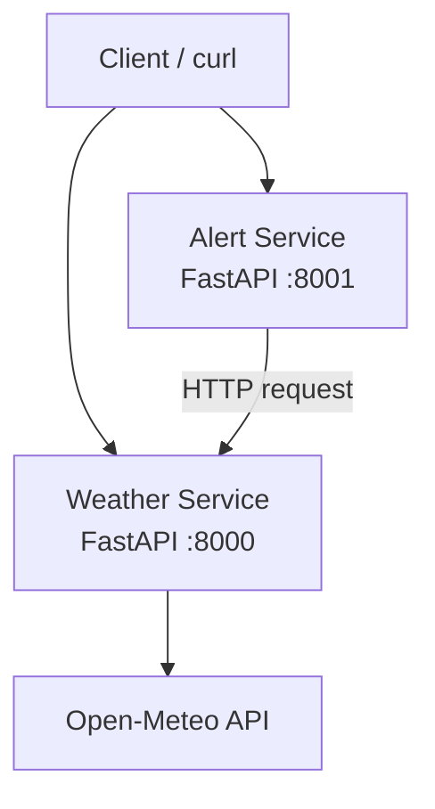
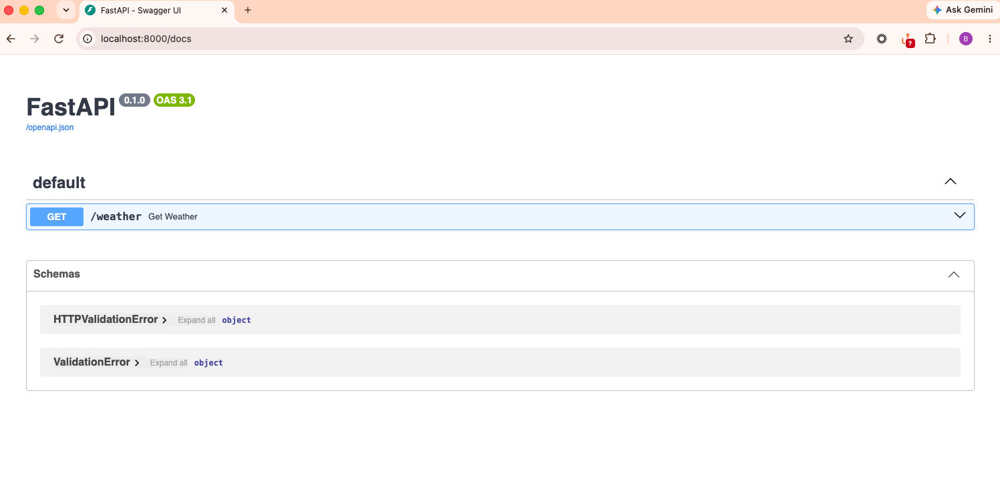
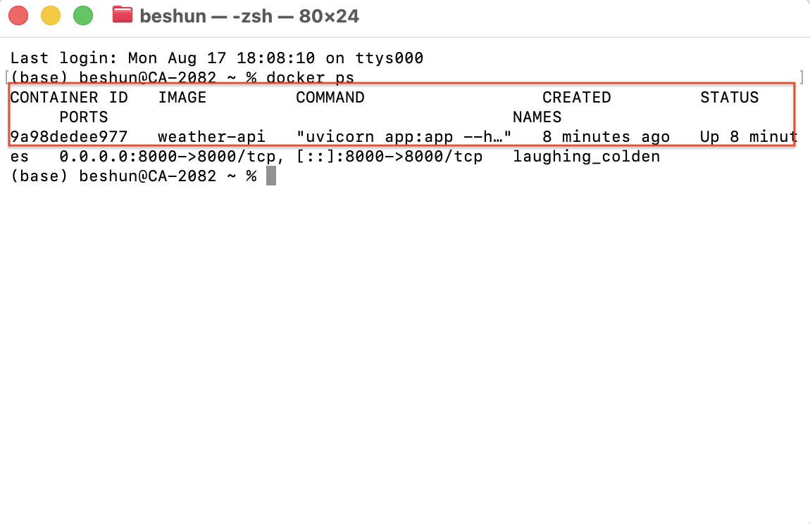
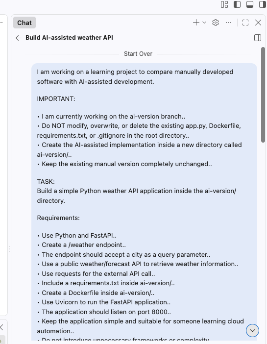
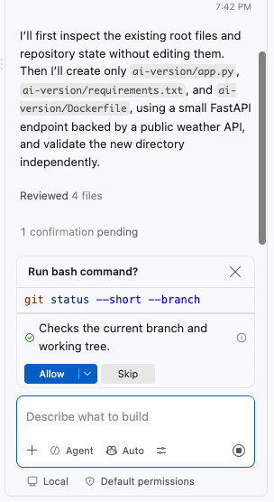
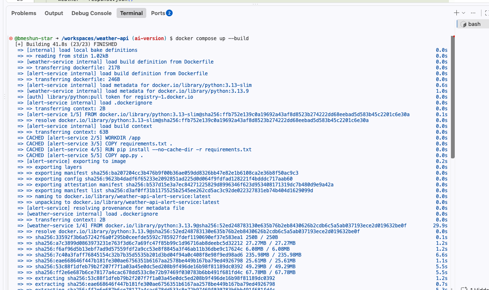
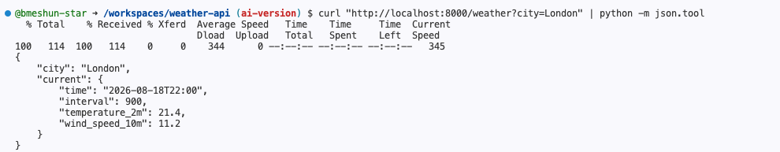
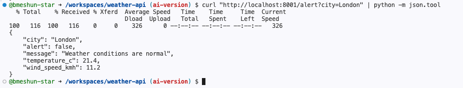

# Weather API — Manual vs AI-Assisted Development

A small Python/FastAPI project created to explore the difference between manually developing an application and using AI-assisted development.

The project started as a simple weather API and was then extended with an AI-assisted implementation and a second service to demonstrate Docker Compose and service-to-service communication.

---

## :dart: Project Goals

The main goals of this project were to understand:


• How a simple Python API works.
• How FastAPI exposes an HTTP endpoint.
• How an application communicates with an external API.
• How to containerise a Python application using Docker.
• The difference between manual and AI-assisted development.
• How multiple containers communicate with each other.
• How Docker Compose can orchestrate multiple services.

---

## :building_construction: Architecture

The project consists of two services:


• **Weather Service** — retrieves weather information from Open-Meteo.
• **Alert Service** — consumes the Weather Service and applies simple alert logic.



### Weather Service

```text
GET /weather?city=London
```

The Weather Service retrieves the location and current weather information from Open-Meteo.

### Alert Service

```text
GET /alert?city=London
```

The Alert Service receives weather data from the Weather Service and checks whether an alert should be triggered.

An alert is generated when:


• Temperature is above 30°C.
• OR wind speed is above 40 km/h.

---

# 1. Manual Version

The first version was developed manually to understand the basic application flow before creating the AI-assisted version.

This was my first time building and containerising an application like this, so I used documentation, YouTube tutorials and AI assistance when I needed help understanding concepts or troubleshooting problems.

The application uses:


• Python.
• FastAPI.
• Requests.
• Open-Meteo API.

### Basic flow

```text
Client
  ↓
FastAPI endpoint
  ↓
Python application
  ↓
Open-Meteo API
  ↓
JSON weather response
```

### Run locally

Install the dependencies:

```bash
pip install -r requirements.txt
```

Start the application:

```bash
uvicorn app:app --reload
```

Test the endpoint:

```bash
curl "http://localhost:8000/weather?city=London"
```

FastAPI documentation is also available at:

```text
http://localhost:8000/docs
```

---

# 2. Dockerising the Application

The manual application was then containerised using Docker.

The Dockerfile:


1. Uses a Python base image.
2. Creates `/app` as the working directory.
3. Copies the application and requirements.
4. Installs the dependencies.
5. Exposes port 8000.
6. Starts the application using Uvicorn.

### Build the Docker image

```bash
docker build -t weather-api .
```

### Run the container

```bash
docker run -p 8000:8000 weather-api
```

### Check running containers

```bash
docker ps
```

Docker allowed the application and its dependencies to run in an isolated container rather than directly on the host machine.

---

# 3. AI-Assisted Version

The second implementation was created using AI assistance.

The goal was to compare the development process and implementation with the manually created version.

The AI-assisted version is located in:

```text
ai-version/
```

The AI-assisted implementation:


• Uses FastAPI.
• Uses Requests.
• Uses Open-Meteo geocoding.
• Retrieves current weather data.
• Validates the city input.
• Handles upstream API failures.
• Uses request timeouts.
• Returns clear HTTP errors.

### Build

```bash
docker build -t weather-api-ai ai-version
```

### Run

```bash
docker run --rm -p 8000:8000 weather-api-ai
```

### Test

```bash
curl "http://localhost:8000/weather?city=London"
```

---

# 4. Manual vs AI-Assisted Development

| Area | Manual Version | AI-Assisted Version |
|---|---|---|
| Development | Developed manually with learning resources and troubleshooting help | Developed with AI assistance |
| Framework | FastAPI | FastAPI |
| External API | Open-Meteo | Open-Meteo |
| HTTP client | Requests | Requests |
| Docker | Dockerfile | Dockerfile |
| Input validation | Basic | More explicit |
| Error handling | Basic | More comprehensive |
| Request timeouts | Basic/none | Explicit timeout |
| Testing | Manual testing | AI-assisted mocked tests and Docker validation |

### What I learned

The AI-assisted version was faster to implement and provided useful suggestions for error handling, testing and structure.

However, using AI did not remove the need to understand the code.

I still needed to review the generated implementation, test it, understand the architecture and troubleshoot issues.

The comparison helped me understand that AI can accelerate development, but the developer remains responsible for understanding and validating the result.

---

# 5. My Development Experience

This was my first time building and containerising an application like this, so I did not know the complete process from the beginning.

Even while building the manual version, I used documentation, YouTube tutorials and AI assistance to understand concepts and troubleshoot problems when I got stuck.

I came across several obstacles along the way, including:


• Understanding how to create the FastAPI endpoint.
• Connecting the application to an external weather API.
• Understanding API responses and JSON data.
• Creating the Dockerfile.
• Understanding Docker `WORKDIR`, `COPY` and `CMD`.
• Understanding Docker ports and port mapping.
• Building and running the Docker image.
• Debugging errors during development.

The important part for me was that I did not simply copy a finished solution. I worked through the problems, tested different approaches and gradually understood what each part was doing.

By the end, I had successfully built the application manually, containerised it, created an AI-assisted version and extended the project with a second service.

This helped me realise that AI can significantly speed up development, but understanding the underlying code and architecture is still important because I need to be able to review, test and explain what the AI has produced.

---

# 6. Alert Service

A second service was introduced to demonstrate service-to-service communication.

The Alert Service does not call Open-Meteo directly.

Instead, the flow is:

```text
Alert Service
      ↓
Weather Service
      ↓
Open-Meteo
```

The Alert Service requests weather information from the Weather Service and then applies simple business logic.

### Endpoint

```text
GET /alert?city=London
```

### Alert thresholds

An alert is triggered when:

```text
Temperature > 30°C
OR
Wind speed > 40 km/h
```

### Example response

```json
{
  "city": "London",
  "alert": false,
  "message": "Weather conditions are normal",
  "temperature_c": 21.5,
  "wind_speed_kmh": 11.5
}
```

---

# 7. Docker Compose

Docker Compose is used to run the Weather Service and Alert Service together.

The Compose configuration contains two services:


• `weather-service`.
• `alert-service`.

### Start both services

```bash
docker compose up --build
```

### Weather Service

```text
http://localhost:8000
```

### Alert Service

```text
http://localhost:8001
```

### Test the Weather Service

```bash
curl "http://localhost:8000/weather?city=London"
```

### Test the Alert Service

```bash
curl "http://localhost:8001/alert?city=London"
```

The Alert Service communicates with the Weather Service using the Docker Compose service name:

```text
http://weather-service:8000
```

Docker Compose provides internal networking between the containers, allowing the Alert Service to reach the Weather Service by its service name.

This demonstrates basic service-to-service communication between containers.

---

# 8. Testing and Validation

The project was validated at multiple stages.

### Python syntax validation

```bash
python -m py_compile app.py
```

### AI-assisted endpoint tests

The AI-assisted implementation was tested using mocked responses for:


• Successful weather retrieval.
• Unknown cities.
• Upstream API failures.

### Alert Service tests

The Alert Service was tested for:


• Normal weather.
• High temperature.
• High wind.
• Upstream failure.

### Docker validation

The Weather API and Alert Service were successfully built as Docker images.

### Docker Compose validation

```bash
docker compose config --quiet
```

The Compose configuration passed validation.

### Live service-to-service test

Both services were successfully started using Docker Compose.

The Weather Service returned live weather data and the Alert Service successfully consumed that data through the Weather Service.

Example:

```text
Weather Service
21.5°C / 11.5 km/h
        ↓
Alert Service
        ↓
No alert
```

---

# 9. Screenshots

Screenshots demonstrating the development and testing process will be added here.

### Manual API



### Docker Container



### AI-Assisted Version




### Docker Compose



### Service-to-Service Communication




---

# 10. Key Learnings

This project helped me understand the relationship between:

```text
Python
  ↓
FastAPI
  ↓
External API
  ↓
Docker
  ↓
Containers
  ↓
Docker Compose
  ↓
Service-to-Service Communication
```

The biggest learning was that AI-assisted development can accelerate implementation, but it does not replace the need for understanding.

I still need to understand:


• What the generated code is doing.
• Why the architecture works.
• How services communicate.
• How to test the application.
• How to troubleshoot errors.
• How to explain the solution.

---

# Future Improvements

Possible future improvements include:


• Add environment variables for configuration.
• Add more weather alert conditions.
• Add automated tests.
• Add CI/CD using GitHub Actions.
• Deploy the services to AWS.
• Explore how the architecture could be managed using Kubernetes.
'''

path = Path("/mnt/data/README.md")
path.write_text(readme, encoding="utf-8")
print(f"Created {path} ({len(readme.splitlines())} lines)")
