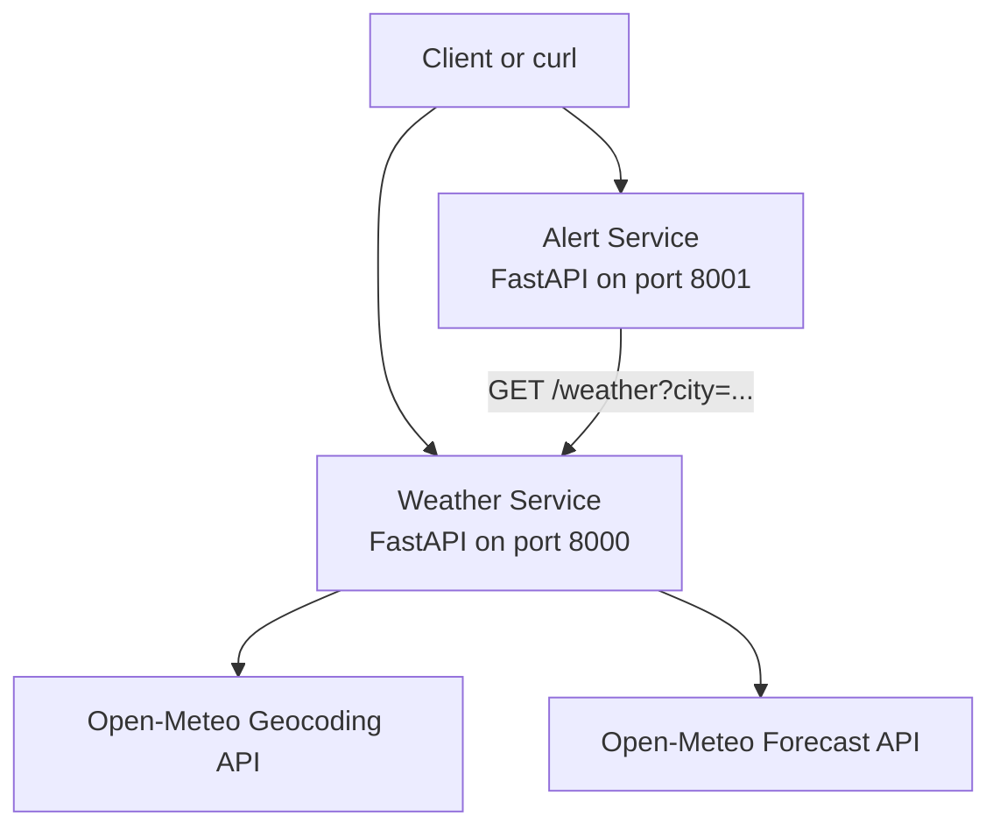
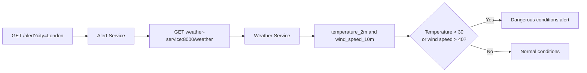
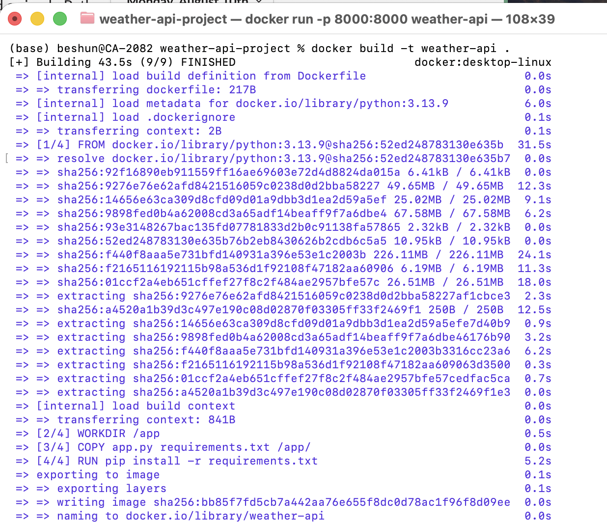

# Weather API: Manual and AI-Assisted Development

A beginner-friendly Python project that exposes current weather data for a city and adds a separate alert service. It documents a manual implementation, an AI-assisted implementation, and the Docker Compose setup used to run the Weather Service and Alert Service together.


## Table of Contents

- [Project Overview + Tech Stack](#project-overview--tech-stack)
- [Quick Start](#quick-start)
- [Architecture](#architecture)
- [Project Goals](#project-goals)
- [Manual Version](#manual-version)
- [Dockerising the App](#dockerising-the-app)
- [AI-Assisted Version](#ai-assisted-version)
- [Manual vs AI Comparison](#manual-vs-ai-comparison)
- [Alert Service](#alert-service)
- [Docker Compose](#docker-compose)
- [Testing & Validation](#testing--validation)
- [Screenshots](#screenshots)
- [Key Learnings](#key-learnings)
- [Future Improvements](#future-improvements)
- [Closing Summary](#closing-summary)

## Project Overview + Tech Stack

The project contains two FastAPI services:

- The Weather Service looks up a city with Open-Meteo geocoding and requests current temperature and wind speed from the Open-Meteo forecast API.
- The Alert Service requests weather data from the Weather Service and evaluates the returned temperature and wind speed.

The root implementation is the manual version. A more defensive implementation is in `ai-version/`, and the Alert Service is in `alert-service/`.

| Technology | Use in this project |
| --- | --- |
| Python 3.13 | Application language and base Docker image version |
| FastAPI | HTTP API framework |
| Uvicorn | ASGI server used to run each API |
| Requests | HTTP calls to Open-Meteo and between Compose services |
| Open-Meteo | Geocoding and forecast data source |
| Docker | Containerises each application |
| Docker Compose | Builds and runs the two services together |

## Quick Start

### Docker Compose

From the repository root, build and start both services:

```bash
docker compose up --build
```

To stop the services:

```bash
docker compose down
```

| Service name | URL | Port | Endpoint |
| --- | --- | --- | --- |
| Weather Service | http://localhost:8000 | 8000 | `/weather?city=London` |
| Alert Service | http://localhost:8001 | 8001 | `/alert?city=London` |

### Manual run

Install the Weather Service dependencies and start the root application:

```bash
pip install -r requirements.txt
uvicorn app:app --reload
```

The AI-assisted Weather Service can be run separately from its directory:

```bash
cd ai-version
pip install -r requirements.txt
uvicorn app:app --reload
```

The Alert Service can also be started directly, but its endpoint expects the hostname `weather-service`, which is provided by the Docker Compose network. Running it by itself therefore does not provide a working weather dependency.

```bash
cd alert-service
pip install -r requirements.txt
uvicorn app:app --port 8001
```

### Test requests

With the relevant service running, request weather data:

```bash
curl "http://localhost:8000/weather?city=London"
```

With Docker Compose running, request an alert:

```bash
curl "http://localhost:8001/alert?city=London"
```

FastAPI's generated documentation is available for each running service at `/docs`:

```bash
curl "http://localhost:8000/docs"
curl "http://localhost:8001/docs"
```

## Architecture



### Weather Service

The root `app.py` exposes `GET /weather` with a required `city` query parameter. It uses Open-Meteo geocoding to find the first result, then requests `temperature_2m` and `wind_speed_10m` from the forecast API. It returns the requested city and the API's `current` object.

The implementation in `ai-version/app.py` uses the same endpoint and weather fields, while also returning the matched country and handling empty or unknown cities and upstream request failures.

### Alert Service

The Alert Service exposes `GET /alert` with a required, non-empty `city` query parameter. It calls `http://weather-service:8000/weather` and uses the returned `current` values to produce an alert result. The internal hostname is available when the services run through Docker Compose.

Example Weather Service response:

```json
{
  "city": "London",
  "current": {
    "time": "2026-08-18T22:00",
    "interval": 900,
    "temperature_2m": 21.4,
    "wind_speed_10m": 11.2
  }
}
```

## Project Goals

- Learn how a Python application can expose an HTTP endpoint.
- Use FastAPI and Uvicorn to serve a small API.
- Understand requests to an external weather API.
- Learn how to build and run a Docker image.
- Compare manual development with AI-assisted development.
- Understand basic communication between two Compose services.

## Manual Version

The manual version is the root application in `app.py`. It is intentionally small: it accepts a city, performs geocoding, retrieves current weather data, and returns JSON.


Technology used:

- Python
- FastAPI
- Uvicorn
- Requests
- Open-Meteo

## Dockerising the App

The root `Dockerfile`:

1. Starts from `python:3.13.9`.
2. Sets `/app` as the working directory.
3. Copies `app.py` and `requirements.txt` into `/app`.
4. Installs the listed Python packages.
5. Documents port 8000 with `EXPOSE`.
6. Starts the FastAPI application with Uvicorn on `0.0.0.0:8000`.

Build the root image:

```bash
docker build -t weather-api .
```

Run it with port 8000 published to the host:

```bash
docker run --rm -p 8000:8000 weather-api
```

## AI-Assisted Version

The AI-assisted Weather Service is located in `ai-version/`. It has its own `app.py`, `Dockerfile`, and `requirements.txt`, so it can be built independently of the root implementation.

Compared with the root implementation, the AI-assisted version adds:

- Required and trimmed city input validation.
- A 10-second timeout for external requests.
- HTTP error handling for upstream requests.
- A `404` response when geocoding returns no results.
- A `502` response for weather or geocoding failures.
- `country` in the response when Open-Meteo provides it.

Build the AI-assisted image:

```bash
docker build -t weather-api-ai ./ai-version
```

Run it:

```bash
docker run --rm -p 8000:8000 weather-api-ai
```

Test it:

```bash
curl "http://localhost:8000/weather?city=London"
```

## Manual vs AI Comparison

| Feature | Manual root version | AI-assisted version |
| --- | --- | --- |
| Weather endpoint | `GET /weather` | `GET /weather` |
| Geocoding | Open-Meteo, first result | Open-Meteo, first result |
| Current data | Temperature and wind speed | Temperature and wind speed |
| Input handling | Required `city` parameter in the function signature | Required, trimmed, non-empty `city` |
| Timeouts | Not configured | 10 seconds for HTTP requests |
| Upstream errors | Not explicitly converted to API errors | Converted to `502` responses |
| Unknown city | Not explicitly handled | Returns `404` |
| Response fields | `city` and `current` | Matched `city`, `country`, and `current` |

### Development reflection

This was my first hands-on project of this kind. I used documentation and AI as learning and troubleshooting support, then reviewed the files and tested the services to understand what was implemented. The comparison helped me see both the speed of AI assistance and the importance of checking generated code rather than treating it as a finished explanation.

### Key finding

AI assistance can suggest useful validation and error handling, but the developer still needs to understand the request flow, verify the behavior, and take responsibility for the final code.

## Alert Service

The Alert Service's workflow is:



Endpoint:

```text
GET /alert?city=London
```

The alert logic is exactly:

- An alert is `true` when `temperature_2m > 30` **or** `wind_speed_10m > 40`.
- Otherwise, `alert` is `false`.
- Alert message: `Weather alert: dangerous conditions`.
- Normal message: `Weather conditions are normal`.
- The returned fields are `city`, `alert`, `message`, `temperature_c`, and `wind_speed_kmh`.

Example response:

```json
{
  "city": "London",
  "alert": false,
  "message": "Weather conditions are normal",
  "temperature_c": 21.4,
  "wind_speed_kmh": 11.2
}
```

## Docker Compose

The Compose file defines two services:

| Service | Build context | Host port | Container port | Depends on |
| --- | --- | --- | --- | --- |
| `weather-service` | Repository root and root `Dockerfile` | 8000 | 8000 | None |
| `alert-service` | `./alert-service` | 8001 | 8001 | `weather-service` |

Both services are attached to Docker Compose's default network. This is used by the Alert Service's configured URL, `http://weather-service:8000/weather`, to reach the Weather Service by its service name. The host ports make the two APIs available from the machine running Docker.

Start the services:

```bash
docker compose up --build
```

Run them in the background:

```bash
docker compose up --build -d
```

Stop and remove the Compose services:

```bash
docker compose down
```

## Testing & Validation

The repository does not include a test suite. The following checks can be performed with the current files:

Check Python syntax:

```bash
python -m py_compile app.py
python -m py_compile ai-version/app.py
python -m py_compile alert-service/app.py
```

Validate the Compose configuration:

```bash
docker compose config --quiet
```

Build the images through Compose:

```bash
docker compose build
```

With the services running, exercise the implemented endpoints:

```bash
curl "http://localhost:8000/weather?city=London"
curl "http://localhost:8001/alert?city=London"
```

These live requests require network access to Open-Meteo. Responses can change because the weather data is current data from the external API.

## Screenshots

### Manual Weather API documentation


### Docker image build



### Running Docker container


### Docker Compose build


### AI-assisted Weather Service response


### Alert Service response


### Service communication


## Key Learnings

The relationship I learned through this project is:

```text
Python
  -> FastAPI
  -> Uvicorn
  -> Dockerfile
  -> Docker Image
  -> Container
  -> Docker Compose
  -> Services
```

Python contains the application logic. FastAPI defines the HTTP endpoints, and Uvicorn serves the application. The Dockerfile describes how to package the application into a Docker image. Running that image creates a container. Docker Compose then builds and runs the Weather Service and Alert Service as connected services.

When using AI, developer responsibilities still include understanding the generated code, checking its assumptions, validating endpoints and error paths, reviewing security and reliability concerns, and being able to explain and maintain the result.

## Future Improvements

- [ ] Add automated tests for successful responses and failure paths.
- [ ] Add configuration through environment variables.
- [ ] Add more weather conditions to the alert logic.
- [ ] Improve handling of external API responses in the root implementation.
- [ ] Add CI checks for syntax, tests, and Docker builds.

## Closing Summary

This project records a practical first step in building APIs, containerising them, and connecting services with Docker Compose. AI helped accelerate learning and implementation, while inspecting, testing, and explaining the code remained part of the development work.

> Build it, inspect it, test it, and understand it.

### References

- [FastAPI documentation](https://fastapi.tiangolo.com/)
- [Uvicorn documentation](https://www.uvicorn.org/)
- [Docker Compose documentation](https://docs.docker.com/compose/)
- [Open-Meteo documentation](https://open-meteo.com/en/docs)
